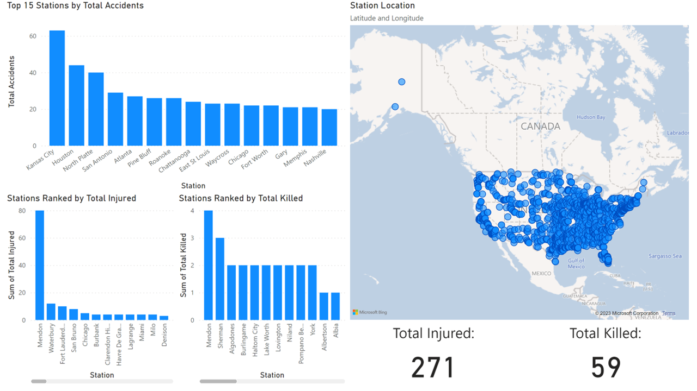
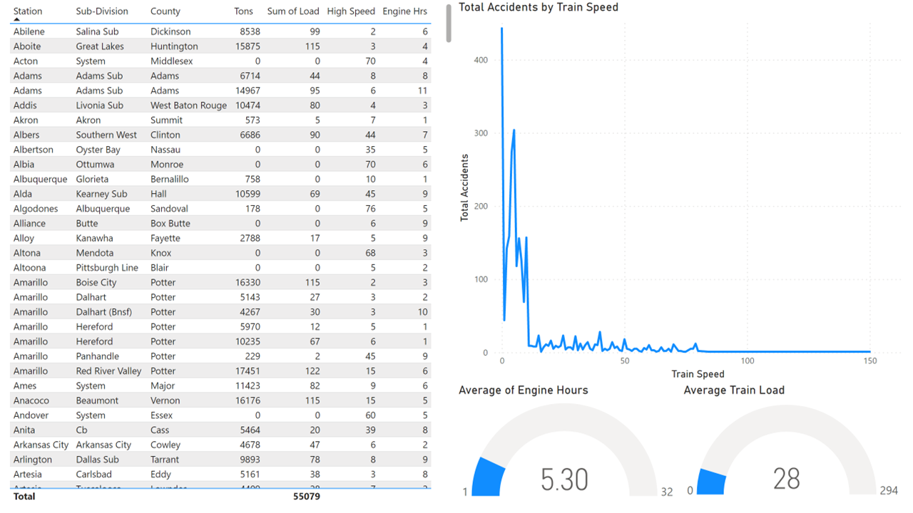
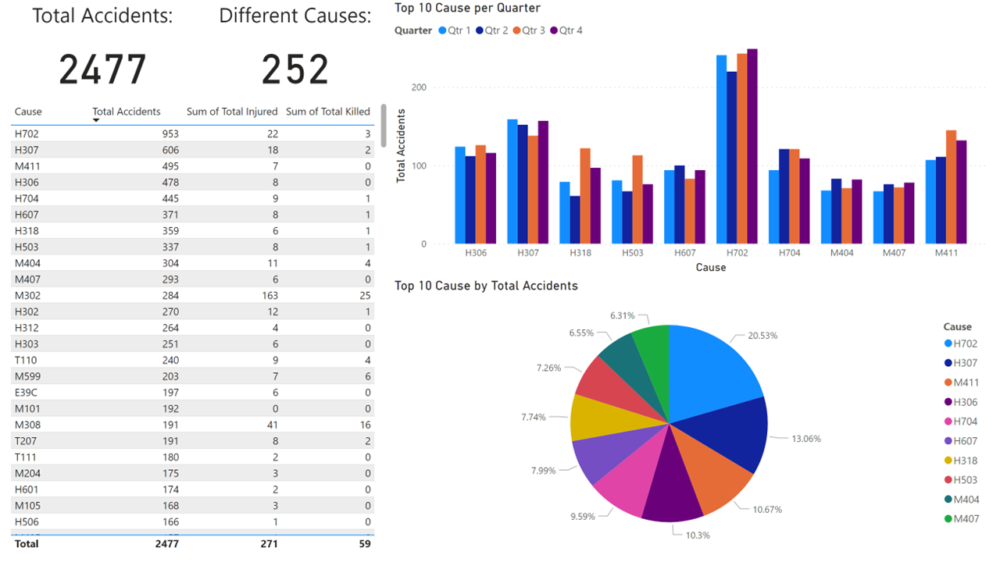
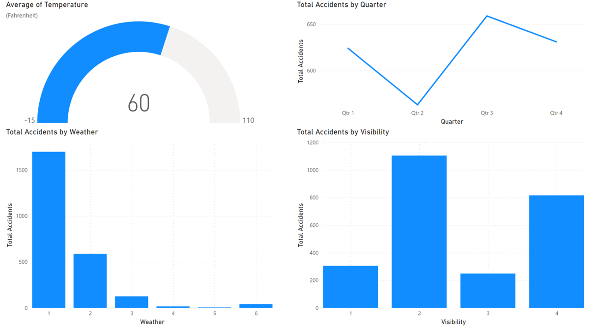

All train accident data is acquired from [railroads.dot.gov](https://railroads.dot.gov/safety-data/accident-and-incident-reporting/train-accident-reports/train-accident-reports)
# Train Accident Report Data (2022)

**IMPORTANT:** PowerBI is not available for Mac

### **To view my project:**
> 1. Download [PowerBI Desktop](https://aka.ms/pbidesktopstore) in Windows Store
> 2. Dowload .pbix file located in this folder

### **To recreate for practice:**
> 1. Download [PowerBI Desktop](https://aka.ms/pbidesktopstore) in Windows Store
> 2. Download CSV file from [railroads.dot.gov](https://railroads.dot.gov/safety-data/accident-and-incident-reporting/train-accident-reports/train-accident-reports) **OR** use existing CSV file in this folder
> 3. If downloading from [railroads.dot.gov](https://railroads.dot.gov/safety-data/accident-and-incident-reporting/train-accident-reports/train-accident-reports), choose the year of data you would like to report. (The CSV file in this folder is data from 2022)
> 4. Upload data into PowerBI

## [Web Dashboard](https://app.powerbi.com/reportEmbed?reportId=d3d451b9-283d-4f57-a32e-594a4eaf66d4&autoAuth=true&ctid=eb095636-1052-4895-952b-1ff9df1d1121)
### Injuries & Fatalities

### Train Specs

### Cause

### Weather

